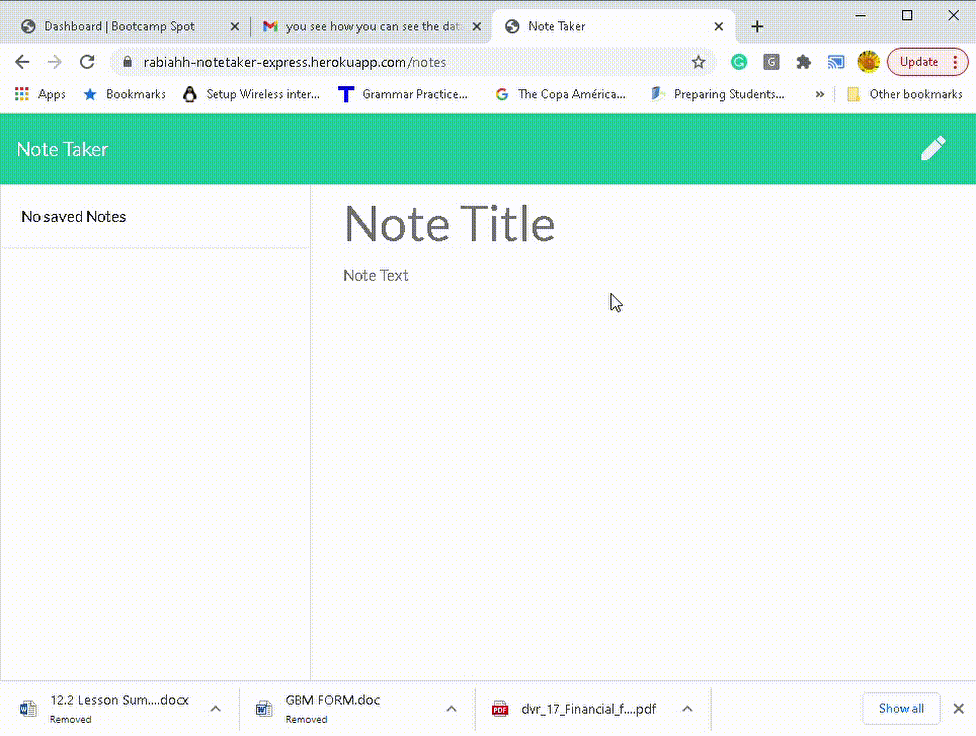

# Unit 11 Express Homework: Note Taker

  

  
 ## Table of Contents
  
* [Description](#Description)
  
* [Installation](#Installation)
  
* [Usage](#Usage)
  
* [License](#License)
  
* [Contributors](#Contributors)
  
* [Questions](#Questions)
  
 ## Description 
  
I built this app for users that need to keep track of a lot of information, it's easy to forget or be unable to recall something important. Being able to take persistent notes allows users to have written information available when needed.

 I create an application that can be used to write, save, and delete notes by  building the backend and connect the frontend. To deploy (view online) [CLICK ME.](https://rabiahh-notetaker-express.herokuapp.com/notes)

 

 ## Installation
  
 💾 
  
* npm init
  
* npm install express
    
 ## Usage
 

With this app a user is able to write and save notes, to delete notes they've written before so, they can organize there thoughts and keep track of tasks they need to complete.

- HTML
- CSS
- JAVASCRIPT
- NODE.JS

* The following HTML routes were created to make these functions possible:

  * GET `/api/notes` - To read the `db.json` file and return all saved notes as JSON.

  * POST `/api/notes` - To receive a new note to save on the request body, add it to the `db.json` file, and then return the new note to the client.

  * DELETE `/api/notes/:id` - To receive a query parameter containing the id of a note to delete. 
  
  
* To save a note click floppy disk icon in upper right
   

 * To delete a note click trash can icon next to the saved note 
    

 ## License
 To view the license click [here](https://choosealicense.com/licenses/mit/)

  
 ## Contributors
  
 Contributions are accepted. Feel free to fork.
1. Fork it
2. Create your feature branch (git checkout -b feature/fooBar)
3. Commit your changes (git commit -am 'Add some fooBar').
4. Push to the branch (git push origin feature/fooBar)
5. Create a new Pull Request# RfHogans

  
  
 ## Questions
  
 If you want have any additional questions, you can reach me at
  
 **Github**: https://github.com/rabiahfh
  
 **Email**: hogansrabiah@gmail.com

